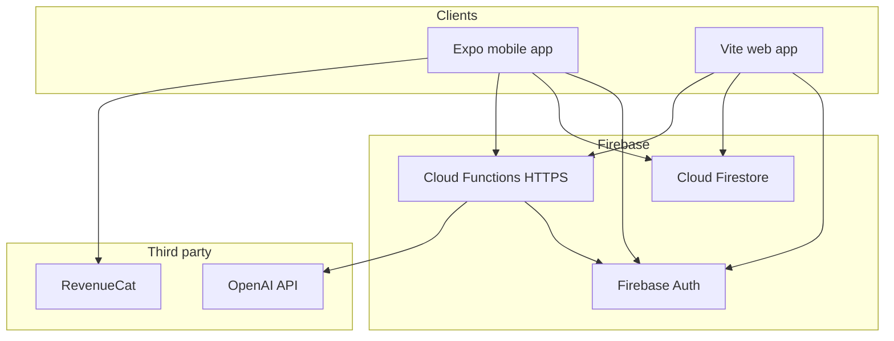

# GMAT Lexicon — Application overview

This document describes **GMAT Lexicon** (also branded **LEXICON** in the mobile shell) from several angles: what it is, how it is built, how pieces connect, how the UI is structured, what the user experience looks like, and what you might extend or align next (e.g. docs vs product).

---

## 1. Product summary

**Purpose:** A **mobile-first** vocabulary product for **GMAT verbal prep**: look up words and phrases, save them to a personal deck, study them (sessions, flashcards, quizzes), and practice in test-like flows.

**Primary surfaces:**

| Surface | Role |
|--------|------|
| **Mobile app (Expo)** | Main product: **Today**, **Learn**, **Test** tabs; full-screen **Session**; **Word stacks** subflow; profile and subscriptions. |
| **Web app (Vite)** | Marketing **landing**, **sign-in/up**, and an authenticated **web client** with routes for home, words list/detail, learn, test, and session (parity with core flows). |
| **Firebase Cloud Functions** | Authenticated **HTTPS APIs** for AI-backed features: word generation, paragraph generation, quiz generation. |

Users authenticate with **Firebase Auth**; vocabulary and profile data live in **Cloud Firestore** under per-user paths. AI calls run server-side (OpenAI) via Functions, not from client secrets.

### 1.1 Vocabulary progress (exposure score)

Each saved word has an **`exposureScore`** (non-negative integer). Interactions in sessions, tests, flashcards, and paragraph practice update the score via Firestore transactions; **`status`** is **`learning`** below 20 and **`mastered`** at 20+. Default study surfaces (daily session, Learn deck default, Test, paragraph picker) prioritize **`learning`** words so mastered items stay out of the main drill path until the user opens filters or drops back below 20 after wrong answers.

---

## 2. Technical stack

### 2.1 Monorepo layout

- **Root** (`package.json`): workspace tooling, **Vite + React** web app, shared **Firebase** dependency, scripts for hosting deploy, emulators, and mobile workspace commands.
- **`mobile/`**: **Expo (React Native)** app — primary UX.
- **`functions/`**: **Firebase Functions v2** (Node 22), **TypeScript** → compiled `lib/`.
- **`shared/`**: TypeScript modules imported as **`@shared/*`** (types, vocab normalization, session logic, quiz shuffle, freemium constants, etc.). Consumed by web, mobile, and/or functions depending on the module.

### 2.2 Mobile (`mobile/`)

| Layer | Technology |
|--------|------------|
| Runtime | **Expo**, **React Native** |
| UI | React components; **expo-blur**, **expo-vector-icons**, custom **glass** styling (`GlassUi.tsx`) |
| Gestures | **react-native-gesture-handler** (e.g. session swipe cards) |
| Auth | **Firebase Auth** (Google, Apple, email flows as implemented) |
| Data | **Firebase Firestore** via modular SDK (`mobile/src/lib/vocab.ts`, etc.) |
| AI HTTP | **Fetch** to Cloud Functions base URL (`mobile/src/lib/api.ts`) with **Bearer ID token** |
| Subscriptions | **RevenueCat** (`react-native-purchases`) — entitlement gates freemium limits |
| Fonts | **Expo Google Fonts** (Inter, Manrope) |

### 2.3 Web (`src/` at repo root)

| Layer | Technology |
|--------|------------|
| Build | **Vite** |
| UI | **React 19**, **React Router** |
| Hosting | **Firebase Hosting** (see root scripts: `build` → deploy hosting) |

### 2.4 Backend (`functions/`)

| Layer | Technology |
|--------|------------|
| Platform | **Firebase Cloud Functions** (HTTP `onRequest`, region e.g. `us-central1`) |
| Admin | **firebase-admin** (verify ID tokens, optional server-side data) |
| AI | **OpenAI** (API key in **function environment**, not in the client) |

### 2.5 Shared code (`shared/`)

Examples:

- **`shared/types.ts`** — `VocabItem`, quiz types, generated result shapes.
- **`shared/vocab.ts`** — Normalization for Firestore word docs; **`exposureScore`** is the source of truth for progress.
- **`shared/exposureScore.ts`** — Score deltas (+1 shown, +2 correct, −1 wrong, floor 0), **`MASTERED_MIN_SCORE` (20)**, and **`status`** derived as learning vs mastered.
- **`shared/sessionPlanner.ts`**, **`shared/paragraphPicker.ts`** — Pick daily session words (learning pool, priority queues) and paragraph targets (ideal score bands, 24h spacing).
- **`shared/sessionOutcome.ts`**, **`shared/sessionQuiz.ts`** — Session batch outcomes (MCQ drives score) and quiz ordering helpers.
- **`shared/freemium.ts`** — Limits (e.g. free session starts, saved words).
- **`shared/wordStackContent.ts`** — Curated stack metadata for **Word stacks**.

---

## 3. Connections & data flow

High-level diagram (logical, not every dependency):

**Typical flows:**

1. **Sign-in** — Client signs in with Firebase Auth → subsequent Firestore and Function calls use the user’s **ID token** (Functions validate `Authorization: Bearer …`).
2. **Vocabulary** — `users/{uid}/words/{wordId}` documents; list/query from mobile/web clients; status updates, flags, `seenCount`, etc. (`mobile/src/lib/vocab.ts` pattern).
3. **Generate word / paragraph / quiz** — Client POSTs to **`/generate`**, **`/generateParagraph`**, **`/generateQuiz`** with JSON body; Functions run OpenAI and return structured JSON (`functions/src/index.ts`).
4. **Pro subscription** — Mobile configures RevenueCat with user id; **entitlement** (e.g. Lexicon Pro) unlocks unlimited session starts vs free tier caps (`SubscriptionContext`, `@shared/freemium`).

**Environment:** Mobile uses a **Functions base URL** (see `mobile/src/lib/env.ts` / `.env`) pointing at deployed or emulator endpoints.

---

## 4. UI architecture (mobile)

### 4.1 Shell & navigation

- **`mobile/src/App.tsx`** — Not React Navigation stacks for the main hub; **local state** (`tab`: `today` | `learn` | `test`) switches screens. **Learn** can embed **Word stacks** (`learnFlow`: `main` | `stacks` | `detail`).
- **Session** is a **full-screen overlay** (`sessionOpen`) over the tab shell, not a separate tab.
- **Header** — “LEXICON” + profile entry; **bottom tab bar** — Today / Learn / Test.
- **Profile** — `ProfileSheet` modal; **paywall** — `SubscriptionPaywall`.

### 4.2 Visual language

- **Learn-area “glass”** — Blurred panels, borders (`learnGlassBorder`), shadows (`glassScreenShadow` from `GlassUi.tsx`), dark/light **learn** palettes (`theme.ts` / `ThemeContext`).
- **Today** — Cards using **`surface2`**, shadows, similar spacing to Learn (see `TodayScreen.tsx`).
- **Session / Test** — Focused full-screen flows; session uses swipe cards and shared **`VocabWordCardContent`** where applicable.

### 4.3 Web UI

- **`AppLayout`** wraps authenticated routes; **nav** and page structure differ from mobile but **routes** mirror concepts: home, words, learn, test, session (`src/App.tsx`).

---

## 5. UX overview (by concept)

### 5.1 Today

- Hub: **streak / stats**, **exam window** (profile), **Start session** (opens full session flow; free tier may hit paywall).
- **Lookup**: type a word/phrase → **Generate** (AI) → **Save** to deck (default **Learning**).
- **Deck stats** — high-level counts; **Learn** is the place to filter and drill.

### 5.2 Session (daily flow)

- **Batch of words** (e.g. up to five), then phases such as **learn (swipe)**, **match**, **MCQ** (meaning in context), **summary** — implemented in `SessionScreen` / `SessionPage` with logic shared in `shared/` where possible.

### 5.3 Learn (mobile)

- **Saved words** list with **search** and **status filters** (e.g. All / Learning / Mastered — product evolves; see current `LearnScreen.tsx`).
- **Tap row** → **flashcard modal** (`LearnFlashcardModal`) with paged horizontal list + scrollable detail (`VocabWordCardContent`, `variant="learn"`).
- **Secondary actions** (flag, status, sync exposure, delete) — consolidated in a **menu** (e.g. “more” sheet), not a dense row of buttons.
- **Word stacks** — separate browse/detail flow from curated packs (`WordStackBrowseScreen`, `WordStackDetailScreen`).
- **Reading practice** — optional **paragraph generation** from a subset of **Learning** items (bottom card pattern), powered by **`generateParagraph`**.

### 5.4 Test

- User picks **mode** (e.g. meaning in context vs GMAT-style verbal), **count**, runs questions; prefers **Learning** items, can fall back to **Mastered** if needed (`TestScreen` / shared quiz helpers).

### 5.5 Auth & onboarding (mobile)

- **Welcome → Sign in / Sign up** with animated transitions (`AuthNavigator` in `App.tsx`).

---

## 6. Cross-cutting concerns

| Topic | Notes |
|--------|--------|
| **Security** | Firestore **rules** restrict `users/{uid}/**` to the owner; Functions verify JWT before AI routes. |
| **i18n / language** | **Main language** (e.g. gloss language) from user profile defaults (`@shared/languages`, `ensureUserProfileDefaults`). |
| **Freemium** | Session limits and saved-word caps enforced in app + shared constants; Pro via RevenueCat. |
| **Consistency** | **Shared types** and vocab normalization reduce drift between web and mobile. |

---

## 7. What to add or refresh (documentation & product)

Use this section as a **checklist** when onboarding or releasing:

1. **README** — Root `README.md` is user-facing for the **web** experience; when **Learn** or **Test** UX changes materially, update the **Learn** / **Test** bullets so they match the app (e.g. filter count, paragraph placement).
2. **Developer setup** — `README-DEV.md` remains the source for env, emulators, deploy.
3. **API contract** — Function endpoints and request/response shapes are defined in **`functions/src/index.ts`** and **`mobile/src/lib/api.ts`**; keep them in sync when adding endpoints.
4. **Word stacks** — Content lives in `shared/wordStackContent.ts` (or related); document new stacks when adding packs.
5. **Analytics / crash reporting** — If you add them, list them here (not present in the stack overview as of this writing).
6. **Web vs mobile parity** — Explicitly note which features are **mobile-only** (e.g. RevenueCat, native session shell) vs **both**.

---

## 8. Quick file map

| Area | Location |
|------|----------|
| Mobile entry & tabs | `mobile/src/App.tsx` |
| Today / Learn / Test / Session screens | `mobile/src/screens/*.tsx` |
| API client | `mobile/src/lib/api.ts` |
| Firestore vocab | `mobile/src/lib/vocab.ts` |
| Glass UI primitives | `mobile/src/components/GlassUi.tsx` |
| Cloud Functions | `functions/src/index.ts` |
| Shared types & logic | `shared/*.ts` |
| Web routes | `src/App.tsx`, `src/pages/*.tsx` |

---

*This file is descriptive documentation for contributors and stakeholders. It is not a legal or marketing commitment.*
